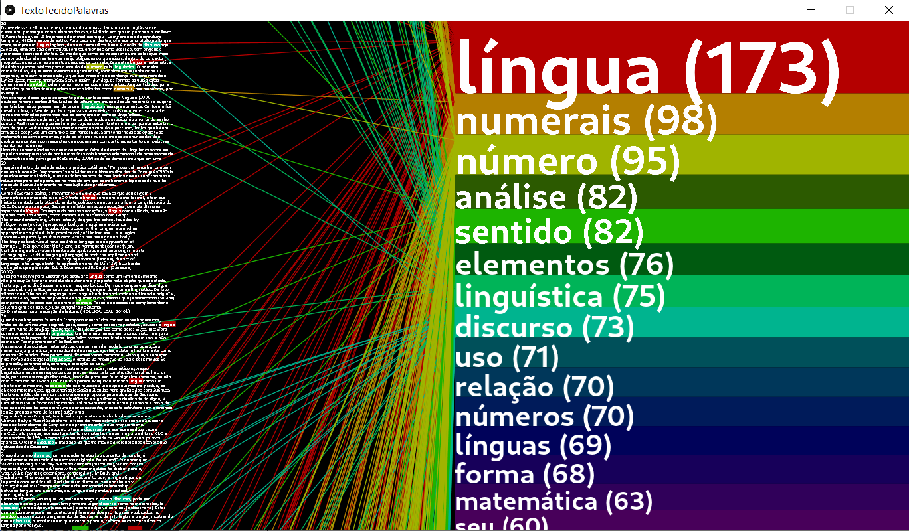

# TextoTecidoPalavras
Localiza palavras mais frequentes num texto.

https://www.youtube.com/watch?v=t1SRuC2Z5U8

## Versão para Windows e Linux (sem precisar instalar Processing)
- Baixe o arquivo .zip para seu sistema operacional (Linux ou Windows):
https://github.com/jarbasjacome/TextoTecidoPalavras/releases
Das opções sem Java, os arquivos são menores, mas necessitam que você tenha Java instalado.
- Descompacte o arquivo .zip
- Abra a pasta "application..." e clique duas vezes no executável TextoTecidoPalavras (para Windows é um arquivo terminado em .exe).

## Como rodar com Processing (serve para Windows, Linux e MacOS)
- Instale o Processing: https://processing.org/download/
- Baixe o código (https://github.com/jarbasjacome/TextoTecidoPalavras/archive/master.zip) ou clone esse repositório.
- Se tiver baixado o master.zip, extraia.
- Abra o arquivo TextoTecidoPalavras.pde no Processing.
- Clique no botão "Play" ou pressione CTRL + r.
